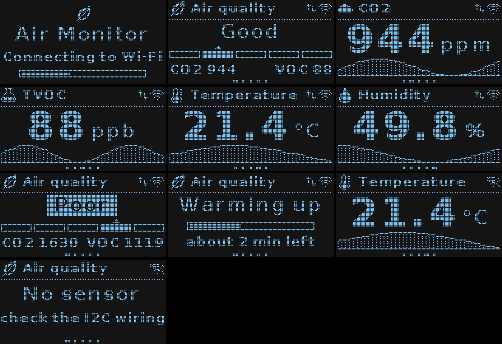
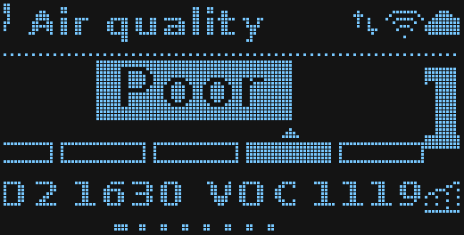

# Air Quality Sensor

An **ESP32** (or ESP8266) running MicroPython reads an **ENS160** air-quality
sensor and an **AHT21** temperature/humidity sensor and shows the readings on an
**OLED** (2.42" SSD1309 or 0.96" SSD1306). It publishes them over **MQTT** to
Home Assistant, and, on the ESP32, over **Bluetooth LE**: to the BLE Sensor
phone app, and as BTHome to Home Assistant.





## Features

- **Air quality, eCO2, TVOC, temperature and humidity,** one page at a time,
  sliding every 5 s. Each page has big digits, an icon and a chart of the last
  hour. Which pages appear and for how long is set over MQTT (`/display`).
- **Accurate readings.** The ENS160 gets the real temperature and humidity as
  compensation. Readings are only reported once its warm-up is done, and an
  optional temperature offset corrects the combo board's self-heating.
- **Bluetooth (ESP32):** the BLE Sensor phone app finds the board as "ESP32
  Air", shows its readings and sets its name and display pages. BTHome
  broadcasts reach Home Assistant without Wi-Fi.
- **MQTT:** averaged readings every minute, requests answered right away
  (`/status`, `/read_all`, …), online/offline availability, and optional Home
  Assistant auto-discovery.
- **Recovers on its own:** Wi-Fi and MQTT reconnect without blocking the
  display, sensors are re-detected, and a watchdog and crash handler restart
  the board.
- **Designed on the PC.** Fonts and icons are generated with Python and
  Pillow, and every screen can be previewed without the board.
- **Android app** (`android/`): live readings with an air-quality gauge and
  charts, display settings and device status, through the MQTT broker.

## Quick start

```sh
python3 -m venv .venv && .venv/bin/pip install -r requirements.txt
cp firmware/config.example.json firmware/config.json     # fill in Wi-Fi + MQTT (git-ignored)
tools/deploy.sh --config                                 # compile, upload, restart
.venv/bin/mpremote connect /dev/ttyUSB0 repl             # watch the log (Ctrl+] quits)
```

Phone app:

```sh
cd android && ./gradlew assembleDebug && ~/Android/Sdk/platform-tools/adb install -r app/build/outputs/apk/debug/app-debug.apk
```

For a board without MicroPython, the Android SDK, or full details, see
[docs/setup.md](docs/setup.md).

## Documentation

| Document | What's in it |
|---|---|
| [docs/hardware.md](docs/hardware.md) | parts, wiring, I2C addresses |
| [docs/setup.md](docs/setup.md) | downloads, flashing MicroPython, configuration, deploying |
| [docs/architecture.md](docs/architecture.md) | the modules, the libraries they use, the main loop, the RAM budget |
| [docs/communication.md](docs/communication.md) | I2C, Wi-Fi, MQTT topics and messages, Home Assistant |
| [docs/bluetooth.md](docs/bluetooth.md) | Bluetooth on the ESP32: advertising, GATT service, BTHome, the BLE Sensor app |
| [docs/sensors.md](docs/sensors.md) | how the ENS160 and AHT21 are driven: registers, compensation, warm-up |
| [docs/display.md](docs/display.md) | the UI, and **how to make a UI like it in Python**: fonts, icons, charts, animation, preview |
| [docs/android-app.md](docs/android-app.md) | the phone app: screens, build, first start, how it talks to the board |
| [docs/troubleshooting.md](docs/troubleshooting.md) | when something doesn't work |

## Repository layout

```
firmware/                  everything that runs on the board (MicroPython)
  main.py, boot.py         start-up
  app.py                   configuration, main loop, watchdog
  sensors.py               ENS160 + AHT21 drivers
  net.py                   Wi-Fi + MQTT
  ble.py                   Bluetooth LE: GATT service + BTHome (ESP32 only)
  commands.py              MQTT requests            (loaded on demand)
  home_assistant.py        Home Assistant discovery (loaded on demand)
  ui.py, gfx.py            display pages, drawing helpers
  assets.py, assets.bin    fonts and icons          (generated)
  config.example.json      settings template; your config.json is git-ignored
tools/                     runs on the PC
  deploy.sh                compile to .mpy, upload, restart
  make_assets.py           generate fonts and icons
  preview.py, sim/         render every screen to PNG without the board
  screenshot.py            capture the real screen from the board
android/                   the phone app (Kotlin, Compose, MQTT)
docs/                      documentation
requirements.txt           PC tools (mpremote, mpy-cross, esptool, Pillow)
```

## Secrets

Wi-Fi and MQTT passwords only live in `firmware/config.json` (on your PC,
git-ignored) and in `config.json` on the board. Nothing else in this
repository contains them. Before committing, `git status` should never list
`firmware/config.json`.
